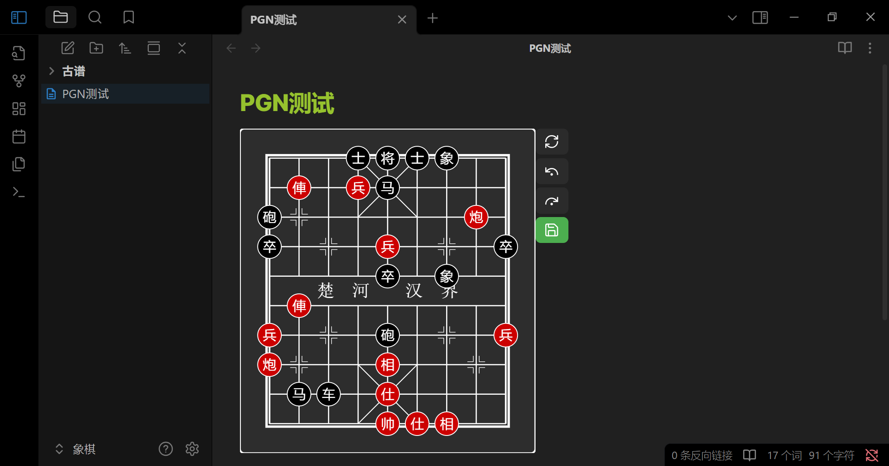
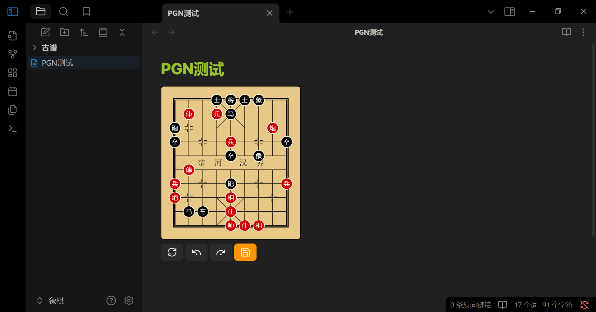

# Obsidian Chinese Chess Plugin


[](./LICENSE)
[](./README.MD)
[](./README.zh-CN.MD)

## Overview

**Obsidian Chinese Chess Plugin** is a rendering engine for Xiangqi (Chinese Chess), designed specifically for Obsidian. It supports displaying chessboards using FEN and PGN formats, as well as manual move previews. It also offers customization options, navigation controls, game saving, and more.

## Demo

````markdown
```xiangqi
3akab2/1R1Pn4/c6C1/p3P3p/4p1b2/1R7/P3c3P/C3B4/1nr1A4/4KAB2
H7-E7 G5-E7
D8-D9 E9-D9
B8-D8 D9-D8
B4-D4 A7-D7
D4-D7 D8-D7
E6-D6 D7-D8
A2-D2 E3-D3
D6-D7 D8-D9
D7-D8 D9-E9
D8-D9
```
````

## Preview




## Features

- **Board Rendering**: Display and replay Chinese Chess games directly in your notes.
- **Customization**:

    - Dark/light theme support
    - Adjustable button position: right or bottom
    - Adjustable board size
    - Settings apply instantly without resetting the game

- **Game Saving**:

    - Save move history as PGN
    - Save button shows **orange** when PGN is empty, **green** when PGN is available
    - Confirmation prompt when saving
    - Saving with no moves clears the PGN

- **Manual Mobile Support**: Works on mobile by manually adjusting board size and button layout
- **Voice Support**: Optional voice narration of moves (toggle in settings)
- **Format Support**: Compatible with FEN and ICCS-style PGN

## Usage

1. Wrap your chess content in a `xiangqi` code block.
2. FEN is optional; if omitted, the game starts from the default position.
3. PGN moves are parsed automatically.
4. Controls:

    - If you haven’t moved manually, "Next" plays PGN moves
    - "Prev" / "Next" navigates move history
    - After manual moves, "Next" won't follow PGN
    - Use "Reset" to resume PGN tracking

5. "Save" replaces PGN with your current move history

## Installation

1. Download the plugin files
2. In Obsidian:

    - Go to **Settings → Community Plugins**
    - Turn off **Safe Mode**

3. Open your plugin folder:

    - On desktop: use 📂 button
    - On mobile: go to `your-vault/.obsidian/plugins` manually
    - Create a folder and place the files inside

4. Enable the plugin

_Note: Coming soon to the official Obsidian plugin marketplace (search “Chinese chess”)_
