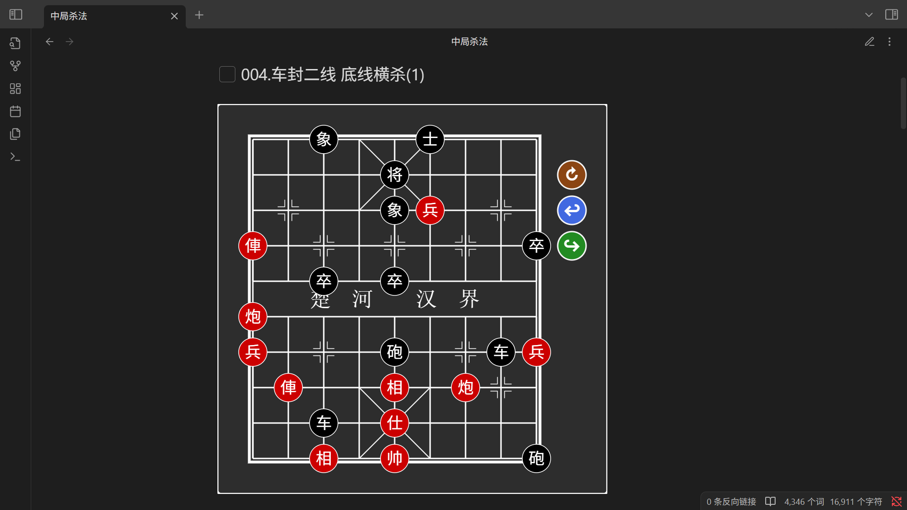

# Obsidian Xiangqi


## 简介
`Obsidian Xiangqi` 是一个为 Obsidian 设计的中国象棋渲染引擎插件，它允许你在 Obsidian 笔记中轻松渲染中国象棋fen格式棋局，并手动推演。支持设置主题、棋盘大小.并可以重置悔棋。
## 演示

## 功能特性
- **棋盘渲染**：在 Obsidian 笔记中渲染中国象棋棋盘。
- **自定义设置**：支持通过设置项对棋盘样式等进行自定义调整。

## 安装步骤

### 手动安装
1. 下载本插件的最新版本压缩包。
2. 在 Obsidian 中打开 `设置` -> `第三方插件`。
3. 关闭 `安全模式`。
4. 点击 `浏览` -> `打开插件文件夹`。
5. 将下载的压缩包解压到该文件夹中。
6. 返回 Obsidian 的 `第三方插件` 页面，找到 `Obsidian Xiangqi` 并启用。

### 自动安装（如果支持）
暂未上架 Obsidian 官方插件市场，后续支持后可直接在 Obsidian 插件市场中搜索 `Obsidian Xiangqi` 进行安装。

## 使用方法
在 Obsidian 笔记中使用 Markdown 代码块，指定语言为 `xiangqi`，并在代码块内输入相应的棋局信息，示例如下：
```xiangqi
这里输入棋局信息
