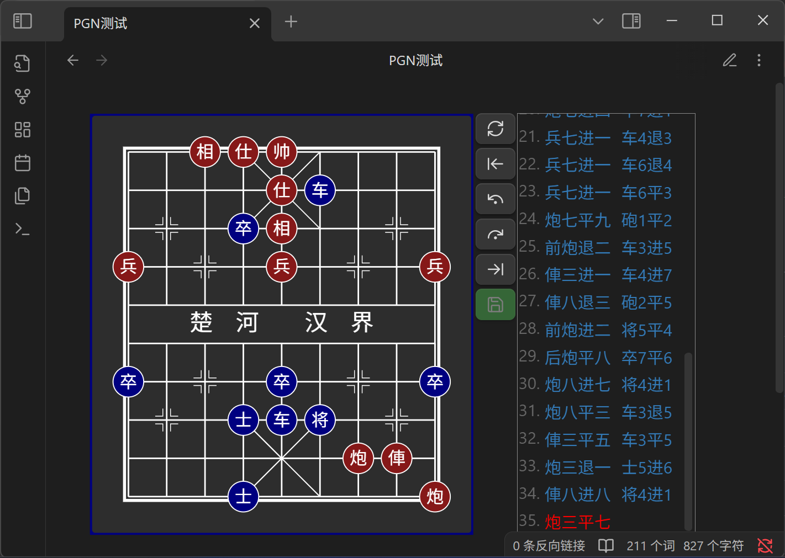

# 中国象棋插件 for Obsidian


[](./LICENSE)
[](./README.en.MD)
[](./README.MD)

## 插件简介

**中国象棋插件(Obsidian)** 是一款为 Obsidian 笔记软件量身打造的中国象棋渲染引擎，支持以 FEN 和 PGN 格式展示棋局，并可进行推演。插件提供丰富的自定义设置、棋谱导航、保存等功能。

## PGN 文件支持

本插件注册了 `.pgn` 文件的专属视图。在 Obsidian 中直接打开 `.pgn` 文件，即可看到渲染后的棋盘界面，而非纯文本。

- **实时读写**：对棋谱的任何操作（如走子、添加变招或评论）都会被实时、自动地保存回原始 `.pgn` 文件。
- **功能完备**：支持分支变招、NAGs（数字注释符号）、评论和标注。


## 代码块示例
提供两种代码块名

---

`xiangqi`: 用于在 Markdown 文件中展示棋谱, 留空为默认开局

````markdown
```xiangqi
1. H2-E2 H9-G7
2. H0-G2 I9-H9
3. I0-H0 B9-C7
....
30. B2-B9 D9-D8
31. B9-G9 C2-C7
32. G7-E7  *
```
````



---

`xq`: 用于生成生成带fEN的`xiangqi`代码段  
`xq`代码块内的内容会被清空换成`FEN`

````markdown
```xq

```
````


---

## 功能特点

- **棋盘渲染**：可在笔记中展示并复盘中国象棋棋局
- **定制开局**:
    - 可视化编辑开局
    - 清空\填满辅助摆放
    - 先后手设置
    - 保存为fen
- **棋谱保存**：
    - 支持将走棋历史保存为 PGN 格式
    - 无 PGN 时保存按钮为**灰色**，有 PGN 时为**绿色**,推演后为**橙色**
    - 点击保存时弹出确认提示
    - 若当前无任何走棋记录，保存操作将清空原有 PGN
- **自定义设置**：

    - 主题支持深色/浅色/跟随系统
    - 按钮位置调整（右侧 / 底部）
    - 棋盘大小
    - 着法列表是否显示
    - 着法文字是否显示,及文字调整
    - 着法列表是否自动跳转到结尾
    - 可选是否朗读着法,移动端不支持

- **移动端适配**：通过手动调整棋盘大小和按钮位置，可适配手机等小屏设备
- **朗读功能**：可选的语音播报走棋内容（可在设置中启用/关闭）
- **格式支持**：支持 ICCS 格式的 PGN 棋谱,

## 使用方法

### `xq`代码块

1. 输入xq代码块标记即可
2. 可手动编辑局面,右侧按钮可以清空填满棋盘,切换先手
3. 编辑好后点击保存,会生成相应的带fen的`xiangqi`代码块

### `xiangqi`代码块

1. 将棋谱写入以 `xiangqi` 标记的代码块中
2. FEN 格式可省略，默认从标准开局开始
3. 操作说明：

    - 若未手动走棋，着法列表会展示PGN
    - 手动走棋后，着法列表将展示手动后的记录
    - 点击“重置”恢复到手动推演前的着法
    - 再次点击"重置"回到最初状态

4. 点击“保存”将用当前走法覆盖原 PGN 内容

### 可选参数

| 名称            | 值         | 描述                                |
| --------------- | ---------- | ----------------------------------- |
| `fen`           | 可用的fen  | 特殊开局的fen代码,留空为默认开局    |
| `protected`/`p` | true/false | ture时保存按钮将失效,留空为false    |
| `rotated`/`r`   | true/flase | true时倒转棋盘,留空为false,红方在下 |

#### 示例

````markdown
```xiangqi
r:true
p:true
2bk1a3/5n3/3Pb4/R7p/2p6/C3p2N1/PR2c3P/1nr1B1C2/4A4/1rB1KA3 w
1. G2-G9 F9-E8
2. D7-D8 D9-E9
3. D8-E8 E9-E8
4. A6-A8 E8-E9
```
````

- 冒号中英文皆可,rp大小写皆可
- fen 两边带不带引号都行,随意
- PGN 两个个一起编号也行,不编号也行
- 一个一个的写也行,怎么都行

## 安装说明

1. 下载插件文件
2. 在 Obsidian 中：

    - 打开 **设置 → 第三方插件**
    - 关闭 **安全模式**

3. 打开插件目录：

    - 电脑端点击 📂 按钮
    - 移动端需手动打开 `你的仓库/.obsidian/plugins`
    - 新建一个文件夹并放入插件文件

4. 启用插件

_注：即将上线 Obsidian 官方插件市场（搜索“Chinese chess”）_
