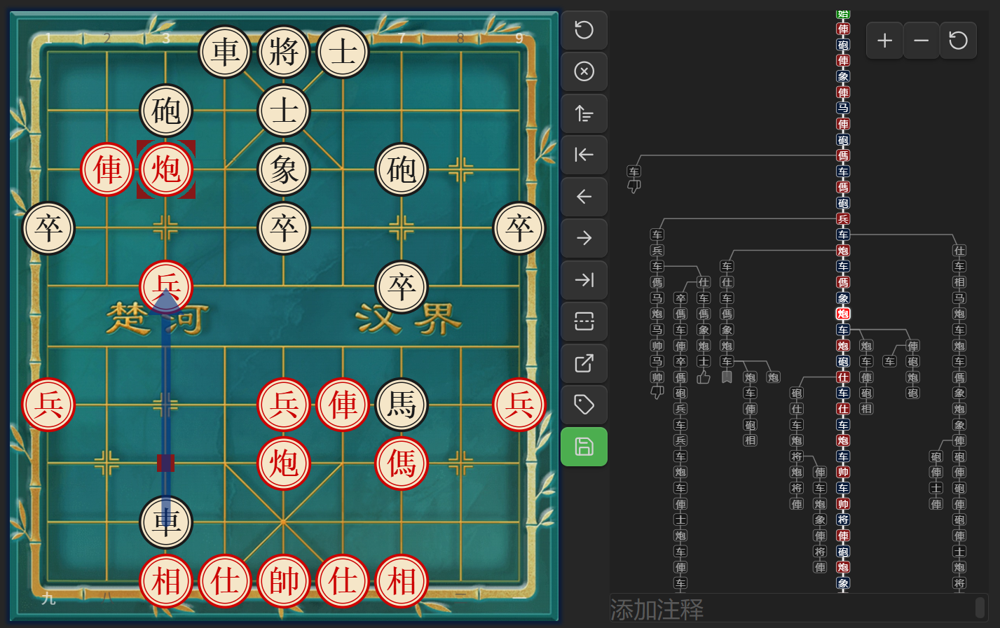
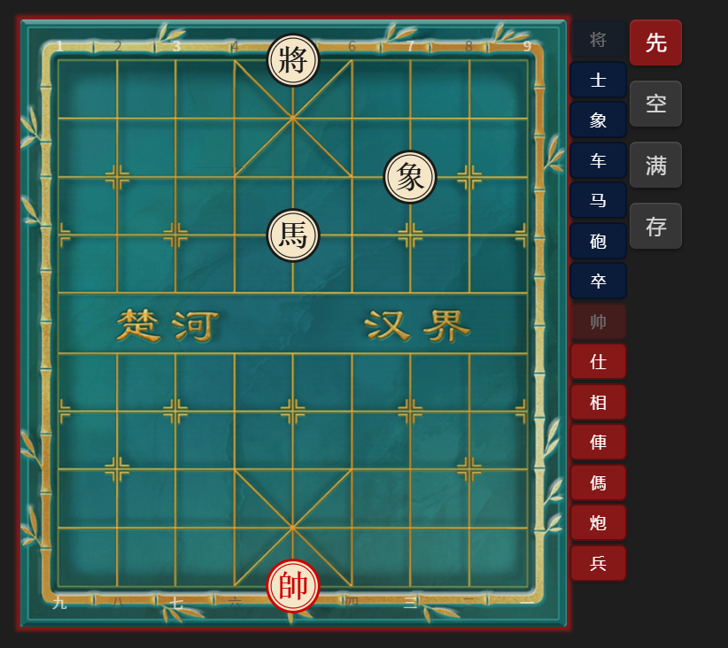

# Chinese chess


[](./LICENSE)

[English](./README.md) | [中文](./README.zh.md)

If you like this project, feel free to check out my page on  
[](https://space.bilibili.com/156446344)  
Likes, coins, and feedback are greatly appreciated.

## Overview

**Obsidian Chinese Chess Plugin** is a Chinese chess rendering engine built for Obsidian. It displays chess positions and games in FEN and PGN formats, supports move exploration and variation management. Features include Pikafish analysis links, voice narration, and more.

## PGN File Support

Open `.pgn` files directly in Obsidian — the plugin registers a dedicated `.pgn` file view with an interactive board interface.

- **Manual Save**: Any changes (moves, variations, comments, annotations) are saved back to the file when clicking Save button
- **Variation Tree**: Interactive tree graph showing all branches — click nodes to navigate
- **Comments & Annotations**: Supports branch diagram and board annotation symbols, comments
- **Mode Toggle**: Switch between icon mode and text mode in branch diagram
- **Jump to AI**: Package the current branch to Pikafish web version for analysis
- **Quick Create**: New PGN files from the ribbon button
- **Custom File Types**: Set specific file types as PGN files



## Code Blocks

Three code block types:
All code block names are customizable

---

`xiangqi`: Display and explore Chinese chess games in Markdown

````markdown
```xiangqi
1. H2-E2 H9-G7
2. H0-G2 I9-H9
3. I0-H0 B9-C7
```
````


---

`xq`: Visual board editor — generates a `xiangqi` block with FEN

````markdown
```xq

```
````



---

`tree`: Branch diagram — display game variations as a tree graph

````markdown
```tree
1. H2-E2 H9-G7
2. H0-G2 I9-H9
```
````


---

## Settings

### Code Block Names

Customize code block aliases in **Settings > Chess > Code Block Names**:

- **List mode** (xiangqi): Default `xiangqi`, add custom aliases separated by commas
- **FEN generation mode** (xq): Default `xq`, add custom aliases
- **Branch diagram mode** (tree): Default `tree`, add custom aliases
- **FEN save type**: Choose which code block type to save as (List mode / Branch diagram mode)

> **Note**: Changes require restarting the plugin or Obsidian to take effect.

### PGN File View

Enable/disable PGN file view and customize file extensions:

- **Enable PGN file view**: Toggle to register/unregister PGN view
- **PGN file extensions**: Default `pgn`, add custom extensions separated by commas

> **Note**: Changes require restarting the plugin or Obsidian to take effect.

## Features

- **Board Rendering**: High-quality chessboard via xiangqiground with drag-and-drop moves
- **Custom Opening**:
  - Visual editor
  - Clear/Fill board
  - Set first player
  - Save as FEN
- **PGN Saving**:
  - Save move history as PGN format
  - Button colors: **gray** (empty), **green** (saved), **orange** (modified)
  - Confirmation dialog before saving
- **Customizable Settings**:
  - Board themes: Wood, Parchment, Green Felt, Marble, Classic Light, Classic Dark
  - 3-layer board background: grid lines + texture + base color
  - Coordinate labels auto-scale with board size
  - Toolbar position: right / bottom
  - Board size and move text size
  - Move list display options
  - Auto-scroll to latest move
  - Optional move narration (desktop only)
- **Board Markers**: Draw arrows and highlights on the board
- **Jump to AI**: Package move list to Pikafish web version for analysis
- **Mobile Friendly**: Adjust board size for small screens

## Usage

### `xq` Code Block

1. Add the `xq` code block tag to start the editor
2. Drag pieces or click piece buttons to set up the position
3. Use clear/fill/turn buttons as needed
4. Click Save to generate a `xiangqi` code block with the FEN

### `xiangqi` Code Block

1. Write your game inside a `xiangqi` code block (optionally with FEN and ICCS moves)
2. FEN is optional — defaults to the standard starting position. Supports parsing Pikafish web links.
3. Controls:
   - When no manual moves are made, the move list shows the original PGN
   - After making moves, the list shows your modified sequence
   - Click **Reset** to revert to before manual edits
   - Click **Reset** again to return to initial state
4. Click **Save** to overwrite the original PGN

### Optional Parameters

| Name              | Value        | Description                                       |
| ----------------- | ------------ | ------------------------------------------------- |
| `fen`             | valid FEN    | Custom starting position; empty = default         |
| `protected` / `p` | true / false | When true, Save button is disabled; default false |
| `rotated` / `r`   | true / false | When true, board is flipped (Red on bottom)       |

#### Example

````markdown
```xiangqi
r:true
p:true
2bk1a3/5n3/3Pb4/R7p/2p6/C3p2N1/PR2c3P/1nr1B1C2/4A4/1rB1KA3 w
1. G2-G9 F9-E8
2. D7-D8 D9-E9
3. D8-E8 E9-E8
4. A6-A8 E8-E9
```
````

- Colons can be Chinese or English; `r` and `p` are case-insensitive
- FEN value works with or without quotes
- PGN moves can be numbered together, not numbered, or written one by one

## Installation

This plugin is available on the official Obsidian plugin marketplace. Search for "Chinese chess" or "xiangqi" to install.

1. Open Obsidian
2. Go to **Settings**
3. Click **Community plugins**
4. Ensure **Restricted mode** is off
5. Click **Browse**
6. Search for "Chinese chess" or "xiangqi"
7. Find this plugin and click **Install**
8. Click **Enable**

### Image Board Assets

The **Wood** and **Bamboo** board themes use image textures. After installation,
download `assets/wood.png` and `assets/bamboo.jpg` from the
[latest release](https://github.com/west-shell/obsidian-xiangqi/releases/latest)
and place them in the plugin's `assets/` folder:

```
.obsidian/plugins/xiangqi/
├── main.js
├── manifest.json
├── styles.css
└── assets/
    ├── wood.png
    └── bamboo.jpg
```

> **Note**: These assets are only needed if you use the Wood or Bamboo board themes. Other themes work without them.

## Build

1. Clone this repository and its dependencies [xiangqiground](https://github.com/west-shell/xiangqiground) and [xiangqi.js](https://github.com/west-shell/xiangqi.js) into the same parent directory:

   ```bash
   git clone https://github.com/west-shell/xiangqiground.git
   git clone https://github.com/west-shell/xiangqi.js.git
   git clone https://github.com/west-shell/obsidian-xiangqi.git
   ```

2. Build xiangqiground first:

   ```bash
   cd xiangqiground
   npm install
   npm run dist
   ```

3. Build xiangqi.js:

   ```bash
   cd ../xiangqi.js
   npm install
   npm run dist
   ```

4. Then build the plugin:

   ```bash
   cd ../obsidian-xiangqi
   npm install
   npm run build        # Dev build (unminified, with sourcemaps)
   npm run build:min    # Minified build (for release)
   ```

## Donation

If you like this plugin, feel free to support me!

