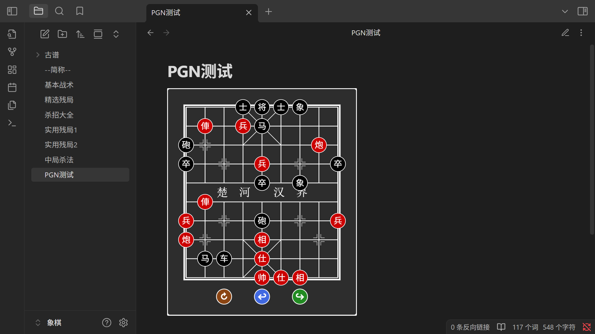
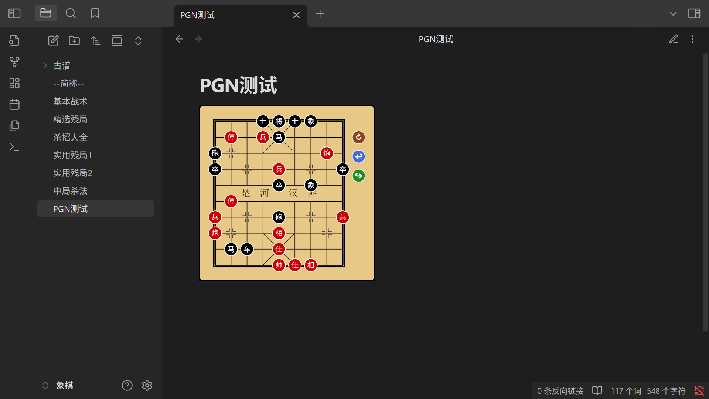

# Obsidian Xiangqi


[](./LICENSE)
[](README.md)
[](README.zh-CN.md)

## 简介

`Obsidian Xiangqi` 是一个为 Obsidian 设计的中国象棋渲染引擎插件，它允许你在 Obsidian 笔记中轻松渲染中国象棋fen格式和pgn格式棋局，并手动推演。支持设置主题、按钮位置、棋盘大小.并可以重置、悔棋、前进。

## 演示

````markdown
```xiangqi
3akab2/1R1Pn4/c6C1/p3P3p/4p1b2/1R7/P3c3P/C3B4/1nr1A4/4KAB2
H7-E7 G5-E7
D8-D9 E9-D9
B8-D8 D9-D8
B4-D4 A7-D7
D4-D7 D8-D7
E6-D6 D7-D8
A2-D2 E3-D3
D6-D7 D8-D9
D7-D8 D9-E9
D8-D9
```
````

## 渲染




## 功能特性

- **棋盘渲染**：在 Obsidian 笔记中渲染中国象棋并推演。
- **自定义设置**：支持通过设置项对主题、按钮位置和前盘大小进行调整。

1.  主题包括暗色和亮色两种。
2.  按钮位置有右侧和下侧两种，方便适应横屏和竖屏。
3.  棋盘大小可以手动连续调节，以适应屏幕大小。
4.  设置更改后自动刷新，并保持现有棋局不变。

- **移动端支持**：需通过手动调整按钮位置和棋盘大小，适配移动端横竖屏。
- **格式支持**：支持fen格式和ICCS格式的pgn棋谱。

## 使用说明

将棋谱信息放在代码块中，指定语言为 `xiangqi`。  
格式相对宽松，能自动识别fen和招法。用fen标注不标注都行。  
不带fen的pgn棋谱，默认为正常开局。  
如从未自己移动棋子，点击下一步按钮，执行pgn棋谱中的招法。  
期间可以上一步和下一步进行展示。  
自己移动棋子后，点击下一步按钮，不再提供pgn招法。  
如要重新展示pgn招法，点击重置按钮。

### 手动安装（暂未上线、暂不支持自动安装）

1. 下载本插件的最新版本文件。
2. 在 Obsidian 中打开 `设置` -> `第三方插件`。
3. 关闭 `安全模式`。
4. 点击 `浏览` -> `打开插件文件夹`。
5. 新建文件夹并将下载的文件放到该文件夹中。
6. 返回 Obsidian 的 `第三方插件` 页面，找到 `Obsidian Xiangqi` 并启用。

暂未上架 Obsidian 官方插件市场，后续支持后可直接在 Obsidian 插件市场中搜索 `Chinese chess` 进行安装。
