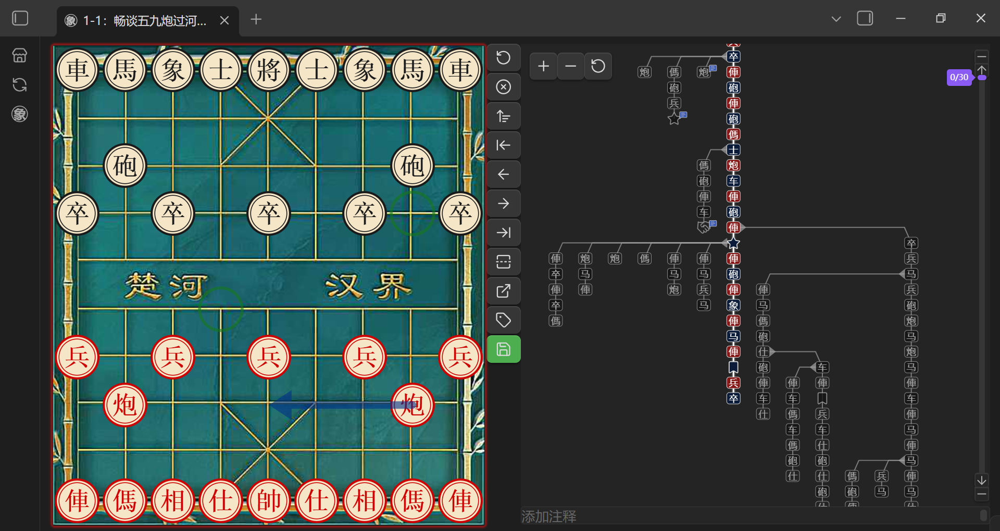
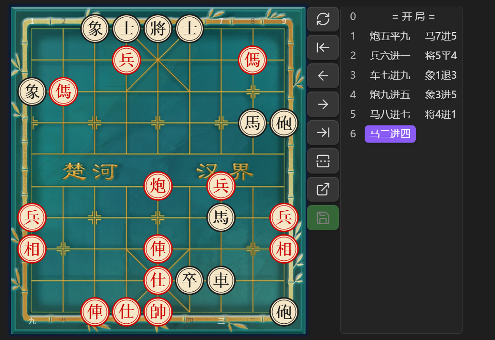
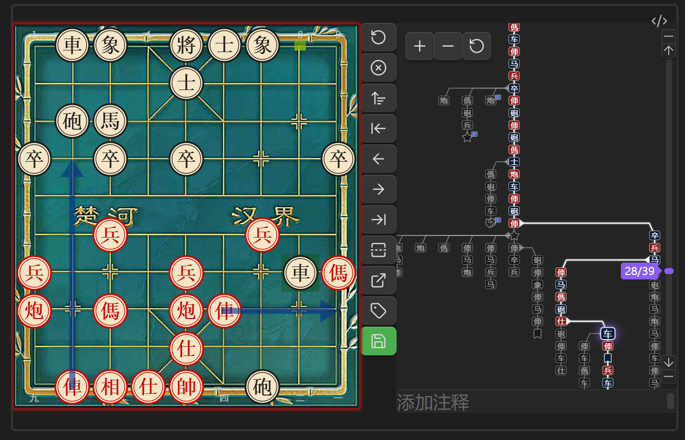
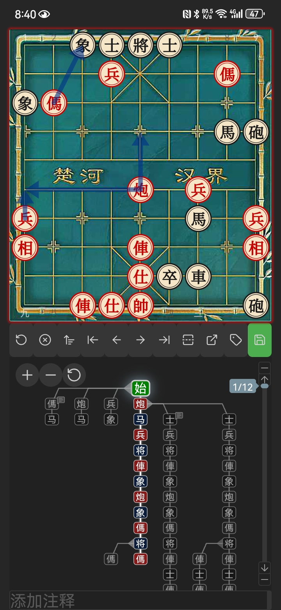

# Obsidian 中国象棋插件


[](./LICENSE)
[](https://paypal.com/paypalme/weshell1988)

[English](./README.md) | [中文](./README.zh.md)

如果你喜欢这个项目，欢迎到我的主页  
[](https://space.bilibili.com/156446344)  
点赞、投币、交流

## 插件简介

**Obsidian 中国象棋插件** 是一款为 Obsidian 笔记软件量身打造的中国象棋渲染引擎，支持以 FEN 和 PGN 格式展示棋局、推演走棋、管理分支变着。支持皮卡鱼分析链接、语音朗读等功能。

## PGN 文件支持

本插件注册了 `.pgn` 文件的专属视图，在 Obsidian 中直接打开 `.pgn` 文件即可查看可交互的棋盘界面。

- **手动保存**：对棋谱的任何操作（走子、添加变招、评论、标注）需点击保存按钮后才会写回原始文件
- **分支变着**：支持 Tree 图展示变着分支，可点击节点跳转
- **评论与标注**：支持分支图和棋盘标注符号、评论
- **切换模式**：分支图支持在图标模式和文本模式之间切换
- **跳转 AI**：支持将当前分支打包到网页版皮卡鱼进行分析
- **快速新建**：工具栏按钮一键新建 PGN 文件
- **自定义文件类型**：可以设置特定文件类型作为 PGN 文件
- **右键菜单**：右键 PGN 文件可在 PGN 视图与 Markdown 视图之间切换

> **注意**：`.pgn` 文件仅支持单局棋谱。多局 PGN 文件建议借助 AI 添加代码块标记转换成 Markdown 格式：
>
> ````markdown
> ```xiangqi
> [Event "第一局"]
> 1. H2-E2 H9-G7 2. H0-G2 I9-H9 1-0
> ```
>
> ```xiangqi
> [Event "第二局"]
> 1. B0-E2 B9-C7 2. G0-F8 H9-G7 1/2-1/2
> ```
> ````



## 代码块

提供三种代码块——均可自定义代码块名称。

---

`xiangqi`：在 Markdown 文件中展示并推演棋局

````markdown
```xiangqi
1. H2-E2 H9-G7
2. H0-G2 I9-H9
3. I0-H0 B9-C7
```
````



---

`xq`：可视化编辑棋盘，保存生成带 FEN 的 `xiangqi` 代码块

````markdown
```xq

```
````


---

`tree`：分支图，以树状图展示棋局变着

````markdown
```tree
1. H2-E2 H9-G7
2. H0-G2 I9-H9
```
````



---

## 移动端使用建议

移动端建议安装 Full Screen Toggle 插件（[donkeypacific/obsidian-full-screen-cross-platform-plugin](https://github.com/donkeypacific/obsidian-full-screen-cross-platform-plugin)）或类似全屏插件，并在 **设置 > Chess > 棋盘边距** 中调节上下边距，以获得最佳的棋盘显示效果。



## 设置

### 棋盘外观

- **主题**：木质、羊皮纸、绿绒布、石纹、经典浅色、经典深色
- **格子大小**：可调节棋盘格子大小（15–100 px）
- **布局**：工具栏位置（右侧 / 底部）
- **坐标标签**：显示/隐藏棋盘坐标

### 对局提示

- **上一步高亮**：在棋盘上高亮上一步
- **合法走法**：显示合法走法目标
- **回合边框**：高亮当前走棋方
- **朗读着法**：可选语音朗读着法（移动端不支持）

### 着法列表

- **显示着法列表**：切换着法列表可见性
- **显示着法文本**：切换着法列表中的文本标注
- **字体大小**：可调节着法文字大小（10–25 px）
- **自动跳转**：跳转到最新位置 — 从不 / 总是 / 自动

### 棋盘边距

- **顶部边距**：可调节顶部边距（0–100 px）
- **底部边距**：可调节底部边距（0–100 px）

### 代码块名称

在 **设置 > Chess > 代码块名称** 中自定义代码块别名：

- **列表模式**（xiangqi）：默认 `xiangqi`，可添加自定义别名
- **FEN 生成模式**（xq）：默认 `xq`，可添加自定义别名
- **分支图模式**（tree）：默认 `tree`，可添加自定义别名
- **FEN 保存类型**：选择保存时使用哪种代码块类型（列表模式 / 分支图模式）

> **注意**：更改后需重启插件或软件才能生效。

### PGN 文件视图

启用/禁用 PGN 文件视图并自定义文件扩展名：

- **启用 PGN 文件视图**：开关控制是否注册 PGN 视图
- **PGN 文件扩展名**：默认 `pgn`，可添加自定义扩展名，逗号分隔

> **注意**：更改后需重启插件或软件才能生效。

## 功能特点

- **棋盘渲染**：基于 xiangqiground 的高品质棋盘，支持拖拽走棋
- **定制开局**：
  - 可视化编辑开局
  - 清空/填满辅助摆放
  - 先后手设置
  - 保存为 FEN
- **棋谱保存**：
  - 支持将走棋历史保存为 PGN 格式
  - 无着法时保存按钮为**灰色**，有着法时为**绿色**，修改后为**橙色**
  - 点击保存时弹出确认提示
- **国际化**：支持中文和英文界面
- **棋局标记**：支持在棋盘上绘制箭头和高亮标记
- **跳转 AI**：支持将着法列表打包跳转到网页版皮卡鱼进行分析
- **移动端适配**：通过调整棋盘大小可适配手机等小屏设备

## 使用方法

### `xq` 代码块

1. 输入 `xq` 代码块标记即可进入编辑器
2. 拖拽或点击棋子按钮摆放，清空/填满棋盘，切换先手
3. 编辑好后点击保存，会生成带 FEN 的 `xiangqi` 代码块

### `xiangqi` 代码块

1. 将棋谱写入 `xiangqi` 代码块中（可含 FEN 和 ICCS 着法）
2. FEN 可省略，默认从标准开局开始。支持解析皮卡鱼网页链接。
3. 操作说明：
   - 未手动走棋时，着法列表展示 PGN 内容
   - 手动走棋后，着法列表展示修改后的记录
   - 点击「重置」恢复到手动推演前的着法
   - 再次点击「重置」回到最初状态
4. 点击「保存」将当前走法覆盖原 PGN 内容

### `tree` 代码块

1. 将棋谱写入 `tree` 代码块中（格式同 `xiangqi`）
2. 分支图以图形方式展示所有变着
3. 点击任意节点可跳转到该位置
4. 支持在图标模式和文本模式之间切换节点标签

### 可选参数

| 名称            | 值         | 描述                                |
| --------------- | ---------- | ----------------------------------- |
| `fen`           | 可用的 FEN | 特殊开局的 FEN 代码，留空为默认开局 |
| `protected`/`p` | true/false | true 时保存按钮失效，默认 false     |
| `rotated`/`r`   | true/false | true 时倒转棋盘（红方在下）         |

#### 示例

````markdown
```xiangqi
r:true
p:true
2bk1a3/5n3/3Pb4/R7p/2p6/C3p2N1/PR2c3P/1nr1B1C2/4A4/1rB1KA3 w
1. G2-G9 F9-E8
2. D7-D8 D9-E9
3. D8-E8 E9-E8
4. A6-A8 E8-E9
```
````

- 冒号中英文皆可，`r` `p` 大小写皆可
- FEN 两边带不带引号都行
- PGN 两个一起编号也行，不编号也行，怎么都行

## 安装说明

本插件已在 Obsidian 官方插件市场上线，搜索 "Chinese chess" 或 "xiangqi" 即可安装。

1. 打开 Obsidian
2. 进入 **设置**
3. 点击 **第三方插件**
4. 确保 **安全模式** 已关闭
5. 点击 **浏览**
6. 搜索 "Chinese chess" 或 "xiangqi"
7. 找到本插件并点击 **安装**
8. 安装完成后点击 **启用**

## 构建

1. 克隆本项目及其依赖 [xiangqiground](https://github.com/west-shell/xiangqiground) 和 [xiangqi.js](https://github.com/west-shell/xiangqi.js) 到同一目录：

   ```bash
   git clone https://github.com/west-shell/xiangqiground.git
   git clone https://github.com/west-shell/xiangqi.js.git
   git clone https://github.com/west-shell/obsidian-xiangqi.git
   ```

2. 先构建 xiangqiground：

   ```bash
   cd xiangqiground
   npm install
   npm run dist
   ```

3. 再构建 xiangqi.js：

   ```bash
   cd ../xiangqi.js
   npm install
   npm run dist
   ```

4. 最后构建本插件：

   ```bash
   cd ../obsidian-xiangqi
   npm install
   npm run build        # 开发版本（不压缩，带 sourcemap）
   npm run build:min    # 精简版本（压缩，适合发布）
   ```

## 打赏

如果喜欢该插件，可以打赏一下哦

[](https://paypal.com/paypalme/weshell1988)


