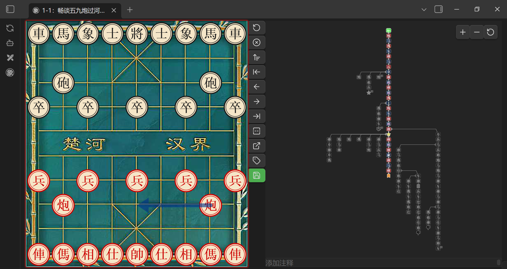
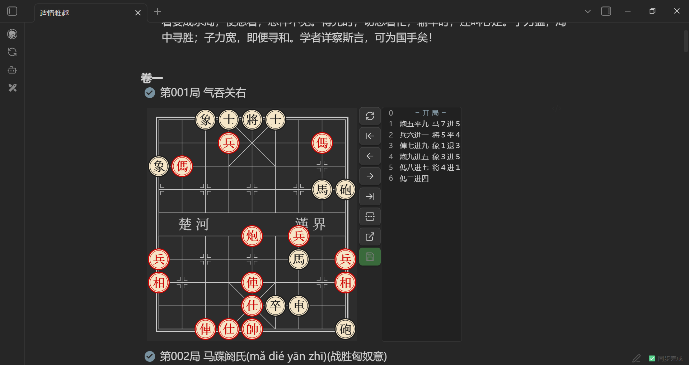
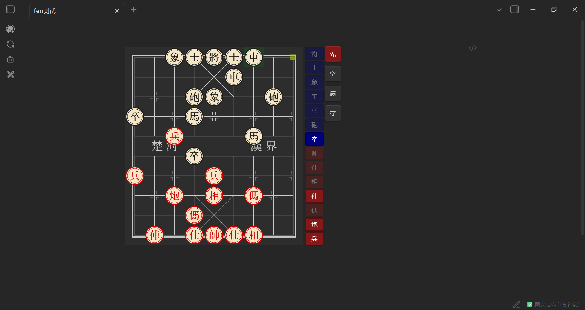

# Chinese chess


[](./LICENSE)

[English](./README.md) | [中文](./README.zh.md)

如果你喜欢这个项目，欢迎到我的主页  
[](https://space.bilibili.com/156446344)  
点赞、投币、交流

## 插件简介

**中国象棋插件(Obsidian)** 是一款为 Obsidian 笔记软件量身打造的中国象棋渲染引擎，支持以 FEN 和 PGN 格式展示棋局，并可进行推演。插件提供丰富的自定义设置、棋谱导航、分支变化和皮卡鱼分析连接等功能。

## PGN 文件支持

本插件注册了 `.pgn` 文件的专属视图。在 Obsidian 中直接打开 `.pgn` 文件。

- **手动保存**：对棋谱的任何操作（如走子、添加变招或评论）需点击保存按钮后才会写回文件。
- **功能完备**：支持分支变招、评论和标注。
- **跳转AI**：支持将当前分支打包到网页版皮卡鱼进行分析
- **切换视图**：支持通过文件菜单在文本视图和象棋视图间切换
- **快速新建**：支持工具栏按钮新建PGN文件



## 代码块示例

提供三种代码块：

---

`xiangqi`: 用于在 Markdown 文件中展示棋谱, 留空为默认开局

````markdown
```xiangqi
1. H2-E2 H9-G7
2. H0-G2 I9-H9
3. I0-H0 B9-C7
....
30. B2-B9 D9-D8
31. B9-G9 C2-C7
32. G7-E7  *
```
````



---

`xq`: 用于生成生成带fEN的`xiangqi`代码段  
`xq`代码块内的内容会被清空换成`FEN`

````markdown
```xq

```
````



---

`tree`：分支图，以树状图展示棋局变着

````markdown
```tree
1. H2-E2 H9-G7
2. H0-G2 I9-H9
```
````

---

## 设置

### 代码块名称

在 **设置 > Chess > 代码块名称** 中自定义代码块别名：

- **列表模式**（xiangqi）：默认 `xiangqi`，可添加自定义别名，逗号分隔
- **FEN 生成模式**（xq）：默认 `xq`，可添加自定义别名
- **分支图模式**（tree）：默认 `tree`，可添加自定义别名
- **FEN 保存类型**：选择保存时使用哪种代码块类型（列表模式 / 分支图模式）

> **注意**：更改后需重启插件或软件才能生效。

### PGN 文件视图

启用/禁用 PGN 文件视图并自定义文件扩展名：

- **启用 PGN 文件视图**：开关控制是否注册 PGN 视图
- **PGN 文件扩展名**：默认 `pgn`，可添加自定义扩展名，逗号分隔

> **注意**：更改后需重启插件或软件才能生效。

## 功能特点

- **棋盘渲染**：可在笔记中展示并复盘中国象棋棋局
- **定制开局**:
  - 可视化编辑开局
  - 清空\填满辅助摆放
  - 先后手设置
  - 保存为fen
- **棋谱保存**：
  - 支持将走棋历史保存为 PGN 格式
  - 无 PGN 时保存按钮为**灰色**，有 PGN 时为**绿色**,推演后为**橙色**
  - 点击保存时弹出确认提示
  - 若当前无任何走棋记录，保存操作将清空原有 PGN
- **自定义设置**：
  - 棋盘主题：木质、羊皮纸、绿绒布、石纹、经典浅色、经典深色
  - 棋盘背景三层叠加：网格线 + 纹理 + 底色
  - 坐标标签随棋盘大小自动缩放
  - 工具栏位置调整（右侧 / 底部）
  - 棋盘大小
  - 着法列表及其文字显示
  - 着法文字大小
  - 着法列表是否自动跳转到结尾
  - 可选是否朗读着法，移动端不支持

- **移动端适配**：通过手动调整棋盘大小和按钮位置，可适配手机等小屏设备
- **朗读功能**：可选的语音播报走棋内容（可在设置中启用/关闭）
- **格式支持**：支持 ICCS 格式的 PGN 棋谱
- **跳转AI**：支持将着法列表打包跳转到网页版皮卡鱼进行分析

## 使用方法

### `xq`代码块

1. 输入xq代码块标记即可
2. 可手动编辑局面,右侧按钮可以清空填满棋盘,切换先手
3. 编辑好后点击保存,会生成相应的带fen的`xiangqi`代码块

### `xiangqi`代码块

1. 将棋谱写入以 `xiangqi` 标记的代码块中
2. FEN 格式可省略，省略则默认从标准开局开始。支持解析皮卡鱼的网页连接。
3. 操作说明：
   - 若未手动走棋，着法列表会展示PGN
   - 手动走棋后，着法列表将展示手动后的记录
   - 点击“重置”恢复到手动推演前的着法
   - 再次点击"重置"回到最初状态
4. 点击“保存”将用当前走法覆盖原 PGN 内容

### 可选参数

| 名称            | 值         | 描述                                |
| --------------- | ---------- | ----------------------------------- |
| `fen`           | 可用的fen  | 特殊开局的fen代码,留空为默认开局    |
| `protected`/`p` | true/false | ture时保存按钮将失效,留空为false    |
| `rotated`/`r`   | true/flase | true时倒转棋盘,留空为false,红方在下 |

#### 示例

````markdown
```xiangqi
r:true
p:true
2bk1a3/5n3/3Pb4/R7p/2p6/C3p2N1/PR2c3P/1nr1B1C2/4A4/1rB1KA3 w
1. G2-G9 F9-E8
2. D7-D8 D9-E9
3. D8-E8 E9-E8
4. A6-A8 E8-E9
```
````

- 冒号中英文皆可,rp大小写皆可
- fen 两边带不带引号都行,随意
- PGN 两个个一起编号也行,不编号也行
- 一个一个的写也行,怎么都行

## 安装说明

本插件已在 Obsidian 官方插件市场上线，搜索”Chinese chess”或者”xiangqi”即可安装。

1. 打开 Obsidian。
2. 进入 **设置** (Settings)。
3. 点击 **第三方插件** (Community plugins)。
4. 确保 **安全模式** (Restricted mode) 已关闭。
5. 点击 **浏览** (Browse) 按钮。
6. 在搜索框中输入 “Chinese chess”。
7. 找到本插件并点击 **安装** (Install)。
8. 安装完成后，点击 **启用** (Enable)。

### 图片棋盘资源

**木质**和**竹纹**棋盘主题使用图片纹理。安装插件后，需要从
[最新 Release](https://github.com/west-shell/obsidian-xiangqi/releases/latest)
下载 `assets/wood.png` 和 `assets/bamboo.jpg`，放入插件的 `assets/` 目录：

```
.obsidian/plugins/xiangqi/
├── main.js
├── manifest.json
├── styles.css
└── assets/
    ├── wood.png
    └── bamboo.jpg
```

> **注意：** 只有使用木质或竹纹主题时才需要这些资源文件，其他主题无需下载。

## 构建

1. 克隆本项目及其依赖 [xiangqiground](https://github.com/west-shell/xiangqiground) 和 [xiangqi.js](https://github.com/west-shell/xiangqi.js) 到同一目录：

   ```bash
   git clone https://github.com/west-shell/xiangqiground.git
   git clone https://github.com/west-shell/xiangqi.js.git
   git clone https://github.com/west-shell/obsidian-xiangqi.git

   ```

2. 先构建 xiangqiground：

   ```bash
   cd xiangqiground
   npm install
   npm run dist
   ```

3. 再构建 xiangqi.js：

   ```bash
   cd ../xiangqi.js
   npm install
   npm run dist
   ```

4. 最后构建本插件：

   ```bash
   cd ../obsidian-xiangqi
   npm install
   npm run build        # 开发版本（不压缩，带 sourcemap，方便调试）
   npm run build:min    # 精简版本（压缩，无 sourcemap，适合发布）
   ```

## 打赏

如果喜欢该插件,可以打赏一下哦

