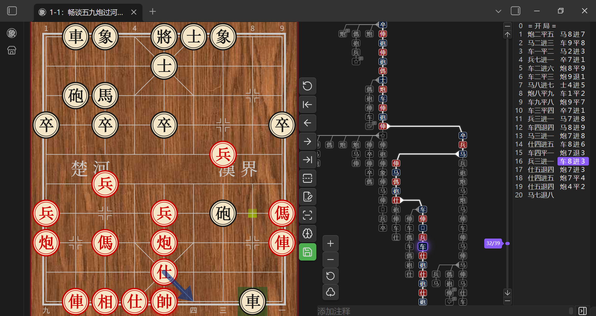
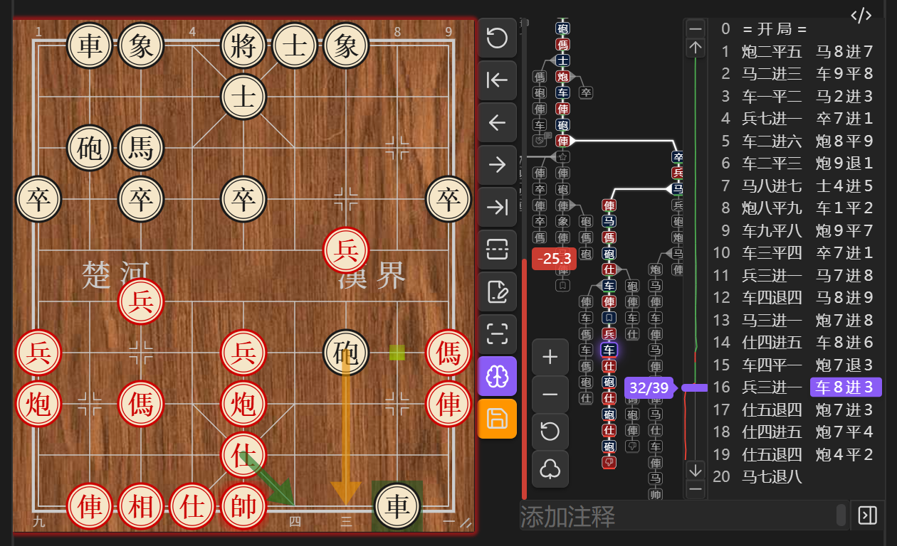
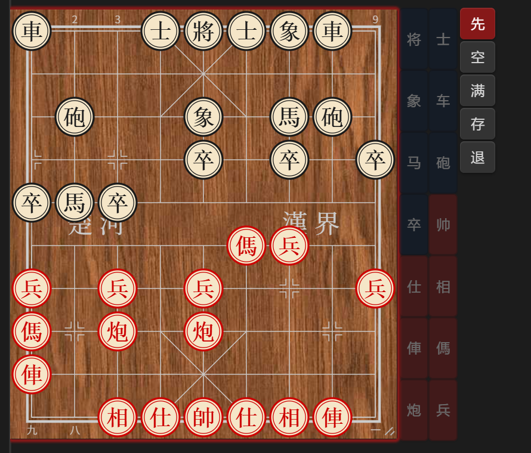
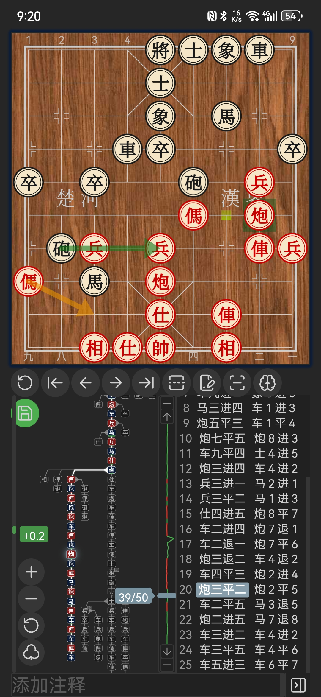

# Obsidian 中国象棋插件


[](./LICENSE)
[](https://paypal.com/paypalme/weshell1988)

[English](./README.md) | [中文](./README.zh.md)

如果你喜欢这个项目，欢迎到我的主页  
[](https://space.bilibili.com/156446344)  
点赞、投币、交流

## 插件简介

Obsidian 中国象棋插件，提供笔记内棋局渲染与探索功能。支持 PGN 文件查看、两种代码块类型（`fen`、`tree`）、基于 [xiangqi.js](https://github.com/west-shell/xiangqi.js) 的完整棋规、通过 [xiangqiground](https://github.com/west-shell/xiangqiground) 实现的交互式棋盘，变着分支树可视化，以及内置 [皮卡鱼](https://github.com/official-pikafish/Pikafish) (WASM) 引擎分析。

## PGN 文件支持

本插件注册了 `.pgn` 文件的专属视图，在 Obsidian 中直接打开 `.pgn` 文件即可查看可交互的棋盘界面。

- **手动保存**：对棋谱的任何操作（走子、添加变招、评论、标注）需点击保存按钮后才会写回原始文件
- **分支变着**：支持 Tree 图展示变着分支，可点击节点跳转
- **评论与标注**：支持分支图和棋盘标注符号、评论
- **切换模式**：分支图支持在图标模式和文本模式之间切换
- **快速新建**：工具栏按钮一键新建 PGN 文件
- **自定义文件类型**：可以设置特定文件类型作为 PGN 文件
- **右键菜单**：右键 PGN 文件可在 PGN 视图与 Markdown 视图之间切换

> **注意**：`.pgn` 文件仅支持单局棋谱。多局 PGN 文件建议借助 AI 添加代码块标记转换成 Markdown 格式：
>
> ````markdown
> ```xiangqi
> [Event "第一局"]
> 1. H2-E2 H9-G7 2. H0-G2 I9-H9 1-0
> ```
>
> ```xiangqi
> [Event "第二局"]
> 1. B0-E2 B9-C7 2. G0-F8 H9-G7 1/2-1/2
> ```
> ````



## 代码块

提供两种代码块——均可自定义代码块名称。

---

`xiangqi`：展示并推演棋局，含变着分支树

````markdown
```xiangqi
1. H2-E2 H9-G7
2. H0-G2 I9-H9
3. I0-H0 B9-C7
```
````



---

`fen`：可视化编辑棋盘，保存生成带 FEN 的 `xiangqi` 代码块

````markdown
```fen

```
````



---

## 移动端使用建议

移动端建议安装 Full Screen Toggle 插件（[donkeypacific/obsidian-full-screen-cross-platform-plugin](https://github.com/donkeypacific/obsidian-full-screen-cross-platform-plugin)）或类似全屏插件，并在 **设置 > Xiangqi > 棋盘边距** 中调节上下边距，以获得最佳的棋盘显示效果。



## 设置

### 棋盘外观

- **主题**：自动、浅色、深色、羊皮纸、绿绒布、木质、竹纹
- **界面大小**：调整棋盘和棋子的显示尺寸（0–100%）
- **显示坐标标签**：在棋盘边缘显示「一二三四五…」和「12345…」列号

### 对局提示

- **显示当前着法**：高亮上一步走棋的起止位置
- **显示后续走法**：是否显示后续走法
- **显示行棋边框**：在行棋方一侧显示高亮边框提示轮到谁走
- **朗读着法**：走棋时用语音播报着法内容（移动端不支持）
- **开局跳转**：打开棋谱时自动定位到哪一步 — 不跳转 / 始终跳转至末尾 / 仅默认开局时跳转

### 着法列表

- **默认显示着法面板**：打开棋谱时默认显示着法列表面板
- **着法文字大小**：调整着法列表中文字的显示大小

### 棋盘边距

- **顶部边距**：可调节顶部边距（0–100 px）
- **底部边距**：可调节底部边距（0–100 px）

### 代码块名称

在 **设置 > Xiangqi > 代码块名称** 中自定义代码块别名：

- **代码块名称**：默认 `xiangqi, tree`——两个名称都渲染树视图（含变着分支树和引擎分析），可添加自定义别名
- **FEN 保存为**：选择 FEN 编辑器保存时使用的代码块名称（默认 `tree`）

> **注意**：更改后需重启插件或软件才能生效。

### 引擎分析

- **引擎深度**：皮卡鱼搜索深度（1–30，默认 18）
- **引擎技能等级**：引擎对弈技能等级（0–20，默认 20）
- **默认保存评估**：保存时是否自动包含评估数据（默认关闭）
- **保存评估提示**：保存含评估数据时是否弹出提示（默认开启）

### 保存

- **默认保存评估**：保存 PGN 时是否包含评估标注（默认关闭）
- **保存评估提示**：保存含评估数据时是否弹出提示（默认开启）

### PGN 文件视图

启用/禁用 PGN 文件视图并自定义文件扩展名：

- **启用 PGN 文件视图**：开关控制是否注册 PGN 视图
- **PGN 文件扩展名**：默认 `pgn`，可添加自定义扩展名，逗号分隔

> **注意**：更改后需重启插件或软件才能生效。

## 功能特点

- **完整棋规**：基于 xiangqi.js，支持将军/将杀检测、走法验证
- **棋盘渲染**：基于 xiangqiground 的高品质棋盘，支持拖拽走棋
- **着法列表**：显示完整走棋记录，点击跳转至任意一步
- **分支变着**：Tree 图展示变着树，支持节点图标/中文两种显示模式
- **可视化编辑**：FEN 编辑器支持拖拽/点击摆放棋子，清空/填满辅助，切换先手
- **棋谱保存**：
  - 无着法时保存按钮为**灰色**，有着法时为**绿色**，修改后为**橙色**
  - 点击保存时弹出确认提示
- **国际化**：支持中文和英文界面
- **棋局标记**：支持在棋盘上绘制箭头和高亮标记
- **引擎分析**：内置皮卡鱼 WASM 引擎，支持单步分析、批量分析和自动分析
  - **最佳走法箭头**：绿色箭头显示引擎最佳走法，黄色箭头显示思考走法
  - **评估条**：左侧边栏评估条（绿色 = 红方优势，红色 = 黑方优势）
  - **评估趋势图**：滑块背景中的折线图，展示全局评估走势
  - **评估色条**：树节点上的颜色条指示评估值（绿色 = 红方优势，红色 = 黑方优势，灰色 = 均势）
  - **评估持久化**：引擎评估以 `%e:` 注释格式保存在 PGN 中
- **响应式布局**：根据屏幕方向和宽度自动切换单栏（竖屏）和双栏（横屏/宽屏）
- **移动端适配**：通过调整棋盘大小可适配手机等小屏设备

## 使用方法

### `fen` 代码块

1. 输入 `fen` 代码块标记即可进入编辑器
2. 拖拽或点击棋子按钮摆放，清空/填满棋盘，切换先手
3. 编辑好后点击保存，`fen` 代码块会被替换为包含 FEN 的 `xiangqi` 代码块，可直接开始下棋

### `xiangqi` 代码块

1. 将棋谱写入 `xiangqi` 代码块中（可含 FEN 和 ICCS 着法）
2. FEN 可省略，默认从标准开局开始
3. 操作说明：
   - 分支图以图形方式展示所有变着
   - 点击任意节点可跳转到该位置
4. 点击「保存」将当前走法覆盖原 PGN 内容
5. 点击编辑菜单中的「编辑棋盘」切换到局面编辑模式
   - 拖拽/点击棋子修改局面
   - 点击保存应用新局面（已有着法将被丢弃）
   - 点击取消返回树视图
6. 引擎分析功能：
   - 点击**分析**按钮进行单步分析，点击**批量**分析所有节点，或开启自动分析
   - 绿色箭头 = 最佳走法，黄色箭头 = 思考走法
   - 左侧评估条显示当前局面评估
   - 节点评估色条和滑块评估趋势图展示全局评估走势

### 可选参数

| 名称            | 值         | 描述                                |
| --------------- | ---------- | ----------------------------------- |
| `protected`/`p` | true/false | true 时保存按钮失效，默认 false     |
| `rotated`/`r`   | true/false | true 时倒转棋盘（红方在下）         |

#### 示例

````markdown
```xiangqi
r:true
p:true
2bk1a3/5n3/3Pb4/R7p/2p6/C3p2N1/PR2c3P/1nr1B1C2/4A4/1rB1KA3 w
1. G2-G9 F9-E8
2. D7-D8 D9-E9
3. D8-E8 E9-E8
4. A6-A8 E8-E9
```
````

- 冒号中英文皆可，`r` `p` 大小写皆可
- FEN 两边带不带引号都行
- PGN 两个一起编号也行，不编号也行，怎么都行

## 安装说明

本插件已在 Obsidian 官方插件市场上线，搜索 "Chinese chess" 或 "xiangqi" 即可安装。

1. 打开 Obsidian
2. 进入 **设置**
3. 点击 **第三方插件**
4. 确保 **安全模式** 已关闭
5. 点击 **浏览**
6. 搜索 "Chinese chess" 或 "xiangqi"
7. 找到本插件并点击 **安装**
8. 安装完成后点击 **启用**

## 构建

1. 克隆本项目及其依赖 [xiangqiground](https://github.com/west-shell/xiangqiground) 和 [xiangqi.js](https://github.com/west-shell/xiangqi.js) 到同一目录：

   ```bash
   git clone https://github.com/west-shell/xiangqiground.git
   git clone https://github.com/west-shell/xiangqi.js.git
   git clone https://github.com/west-shell/obsidian-xiangqi.git
   ```

2. 先构建 xiangqiground：

   ```bash
   cd xiangqiground
   npm install
   npm run dist
   ```

3. 再构建 xiangqi.js：

   ```bash
   cd ../xiangqi.js
   npm install
   npm run dist
   ```

4. 最后构建本插件：

   ```bash
   cd ../obsidian-xiangqi
   npm install
   npm run build        # 开发版本（不压缩，带 sourcemap）
   npm run build:min    # 精简版本（压缩，适合发布）
   ```

## 打赏

如果喜欢该插件，可以打赏一下哦

[](https://paypal.com/paypalme/weshell1988)


