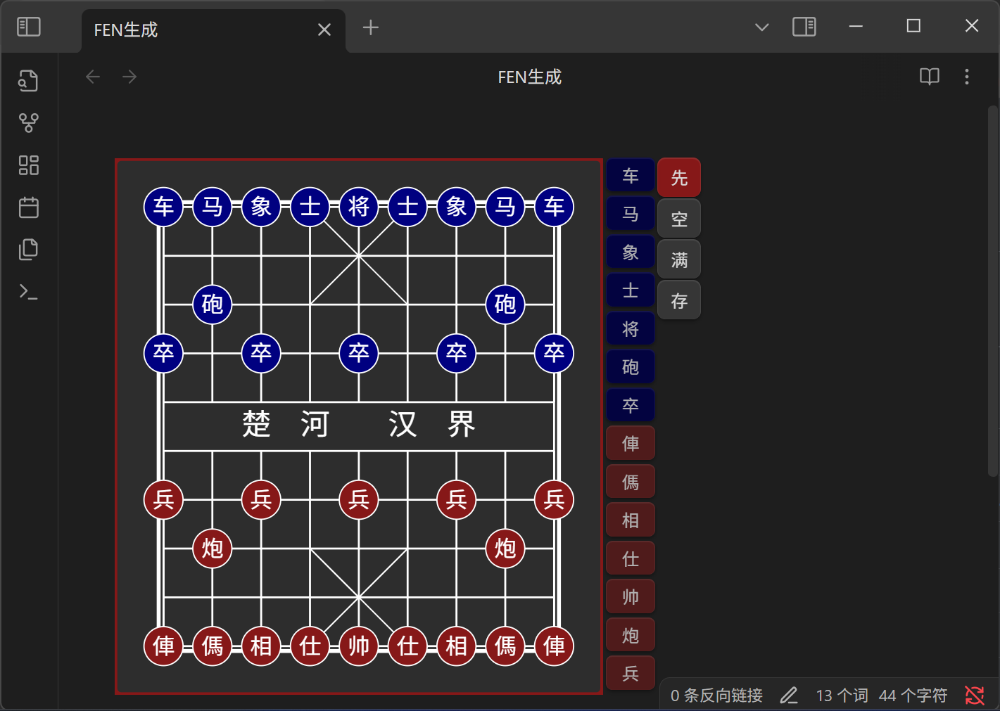

# Chinese Chess Plugin for Obsidian


[](./LICENSE)
[](./READMEen.md)
[](./README.md)

## Plugin Overview

**Chinese Chess Plugin for Obsidian** is a Chinese chess rendering engine tailor-made for Obsidian. It supports displaying chess games in FEN and PGN formats and allows move exploration. The plugin offers rich customization options, move navigation, saving functionality, and more.

## PGN File Support

This plugin registers a custom view for `.pgn` files. Simply open a `.pgn` file in Obsidian to see the rendered board interface instead of plain text.

- **Real-time Read/Write**: Any changes to the game (like making moves, adding variations, or comments) are saved back to the original `.pgn` file instantly and automatically.
- **Full-featured**: Supports variations, comments, and annotations.


## Code Block Demo
Two code block names are supported:

---

`xiangqi` : to display a game in a Markdown file. Leave it empty for the default opening.

````markdown
```xiangqi
1. H2-E2 H9-G7
2. H0-G2 I9-H9
3. I0-H0 B9-C7
....
30. B2-B9 D9-D8
31. B9-G9 C2-C7
32. G7-E7  *
```
````


---

`xq` : to generate a `xiangqi` code block with a FEN string.
`xq` content will be replaced with the FEN.

````markdown
```xq

```
````



---

## Features

- **Board Display**: Show and review Chinese chess games in notes
- **Custom Opening**:
    - Visual editor
    - Clear/Fill board
    - Set first player
    - Save as FEN
- **PGN Saving**:
    - Save move history as PGN
    - Button colors: **gray** (empty), **green** (has PGN), **orange** (edited)
    - Confirm before saving
    - If no moves, saving clears PGN
- **Settings**:
    - Theme: light / dark / system
    - Button position: right / bottom
    - Board size
    - Show/hide move list and move text
    - Auto-scroll to latest move
    - Optional move narration (not on mobile)
- **Mobile Friendly**: Manual layout adjustment for small screens
- **Move Narration**: Optional voice readout of moves
- **Format Support**: Supports ICCS-style PGN

## Usage

### `xq` Code Block

1. Add the `xq` code block tag
2. Manually edit the board; use the buttons to clear, fill, or switch first player
3. Click "Save" to generate a `xiangqi` block with the corresponding FEN

### `xiangqi` Code Block

1. Write the moves inside a code block marked with `xiangqi`.
2. FEN is optional — defaults to the standard starting position.
3. Behavior:

    - If no manual moves, the move list shows the PGN.
    - After manual moves, it shows the updated sequence.
    - Click **Reset** to go back to before manual edits.
    - Click **Reset** again to return to the initial state.

4. Click **Save** to overwrite the original PGN with current moves.

### Optional Parameters

| Name              | Value        | Description                                                       |
| ----------------- | ------------ | ----------------------------------------------------------------- |
| `fen`             | valid FEN    | Custom starting position; empty = default                         |
| `protected` / `p` | true / false | When true, the Save button is disabled; default is false          |
| `rotated` / `r`   | true / false | When true, the board is flipped (Red on bottom); default is false |

#### DEMO

````markdown
```xiangqi
r:true
p:true
2bk1a3/5n3/3Pb4/R7p/2p6/C3p2N1/PR2c3P/1nr1B1C2/4A4/1rB1KA3 w
1. G2-G9 F9-E8
2. D7-D8 D9-E9
3. D8-E8 E9-E8
4. A6-A8 E8-E9
```
````

- Colons can be either Chinese or English.
- `r` and `p` can be uppercase or lowercase.
- The `fen` value can be with or without quotes, either is fine.
- PGN moves can be numbered together, not numbered, or written one by one—any format works.

## Installation

This plugin is now available on the official Obsidian plugin marketplace. Search for "Chinese chess" or "xiangqi" to install it.

1. Open Obsidian.
2. Go to **Settings**.
3. Click on **Community plugins**.
4. Make sure **Restricted mode** is turned off.
5. Click the **Browse** button.
6. Search for "Chinese chess" or "xiangqi" in the search bar.
7. Find this plugin and click **Install**.
8. After installation, click **Enable**.
